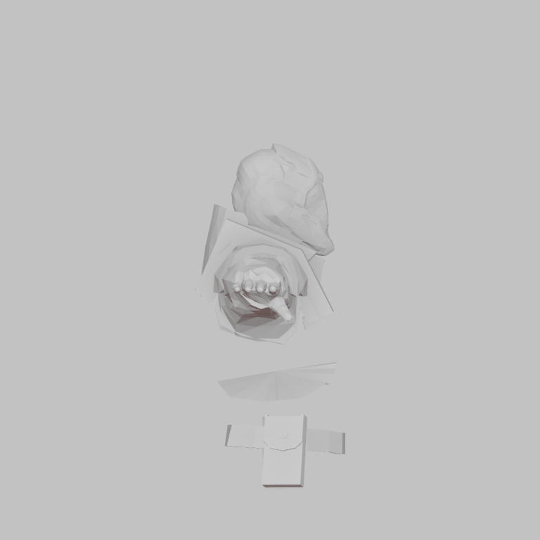
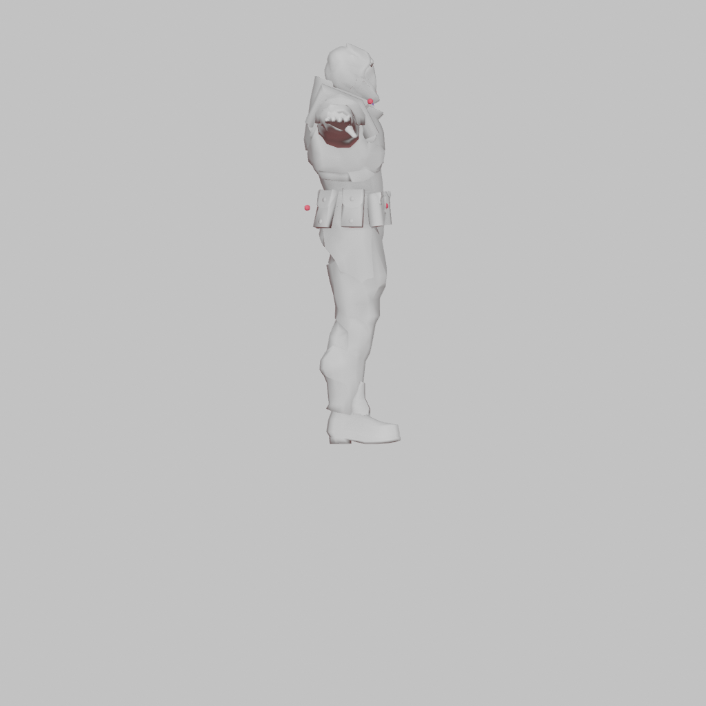
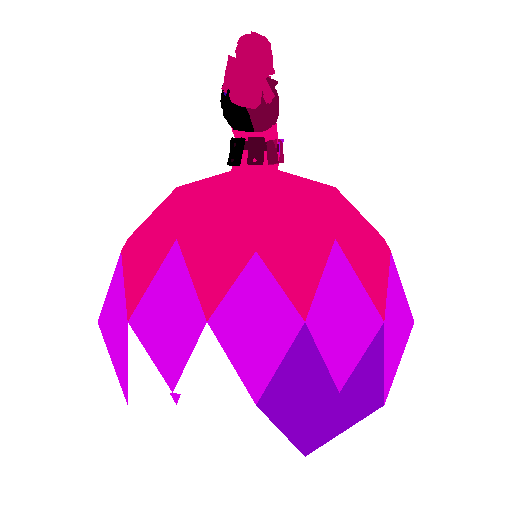
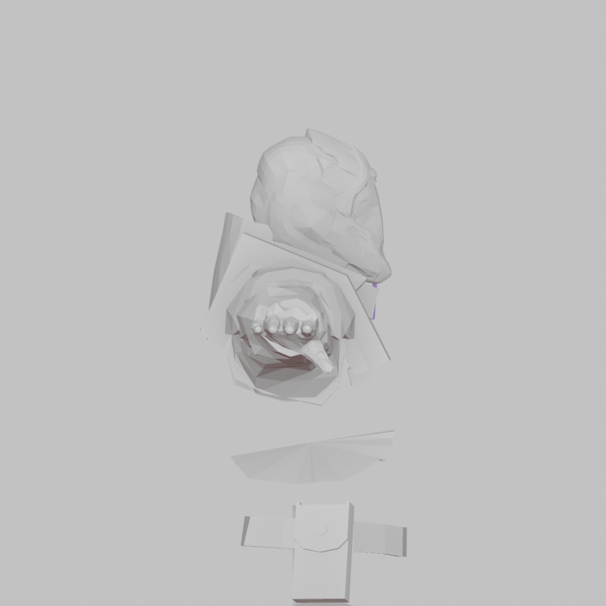
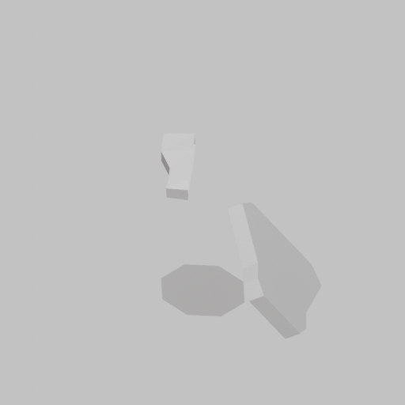
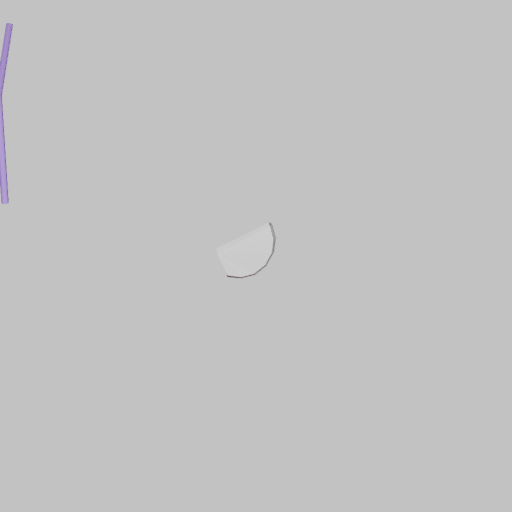

# Avatar Analyzer / Visualizer V4.1 — acceptance evidence

Acceptance was run against the same public GLB before and after the V4.1
upgrade.

- Source: `https://clouva.com.ar/models/base-body.glb`
- SHA-256: `dfb230fc1f942f259dd00281a1186953ad602fc5d69067ce63e24b2aa439736b`
- Requested profile: `BODY_BASIC`
- V4.0 run: `0dd6736864a14c4f9fbb6122c4b3e1db`
- Final V4.1 run: `b4b84f835dea4e50af26c48417e86604`

## Gate results

| Gate | Result |
| --- | --- |
| Version contract | `clouva-avatar-analyzer-v4.1` / `clouva-anatomical-map-v4.1` |
| Optional V4 reanalysis | `completed` |
| Camera bootstrap | Ready; wrist anchors recovered from canonical body refinement |
| Camera calibration | 29/29 valid; maximum round-trip error `0.000227 px` |
| Global BVH | 11,456 / 11,456 source triangles |
| Discarded triangles | 0 |
| Geometric coverage | 100% |
| Semantic coverage | 99.773% |
| Required technical passes | Complete |
| Rejected landmarks at 100% confidence | 0 |
| Diagnostic GLB | Internal skeleton and rejected evidence exported |
| Legacy V3.2 | Preserved |

The same input remains `needs_review`, correctly, because its face and hand
evidence is incomplete/corrupt for the requested rig. V4.1 does not invent
unsupported fingers or promote rejected visual evidence. The right shoulder
remains geometry-backed at `[-0.2087607682, -0.0190965775, 1.0793744326]` with
state `verified_geometry_fallback` and confidence `0.81`.

## Before / after

### V4.0 face crop

### V4.1 body and exact region pass

### V4.1 face and hand evidence

